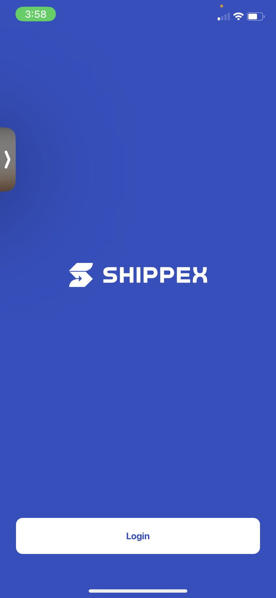
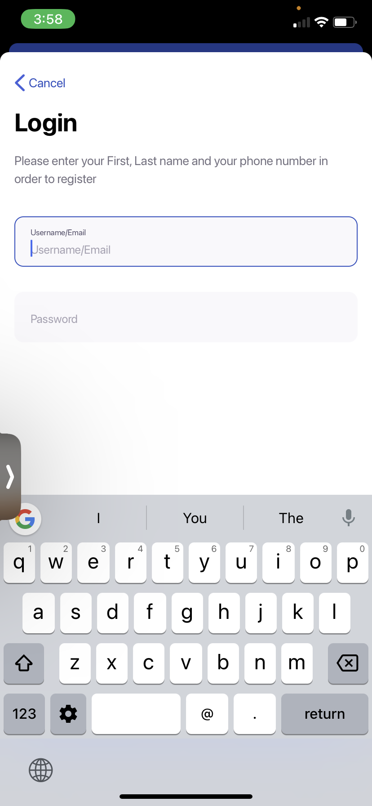
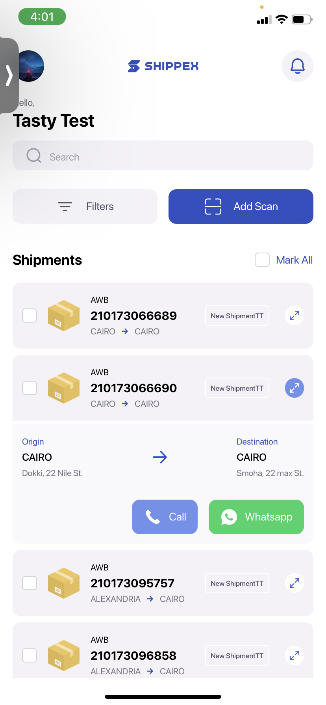

# Proten Test

    

## Run Published App On Expo GO

Doenload Expo Go on app store or Play Store to run the app

    https://apps.apple.com/us/app/expo-go/id982107779
    https://play.google.com/store/apps/details?id=host.exp.exponent&hl=en&gl=US

## Clone git repository and install packages

    git clone https://github.com/OluwaferanmiLove/proten.git
    cd proten

Then install npm packages with yarn

    yarn install

Then install expo packages with

    npx expo install

## Run application

Start metro server

    npx expo start

Open Camera and scan QR code to run
